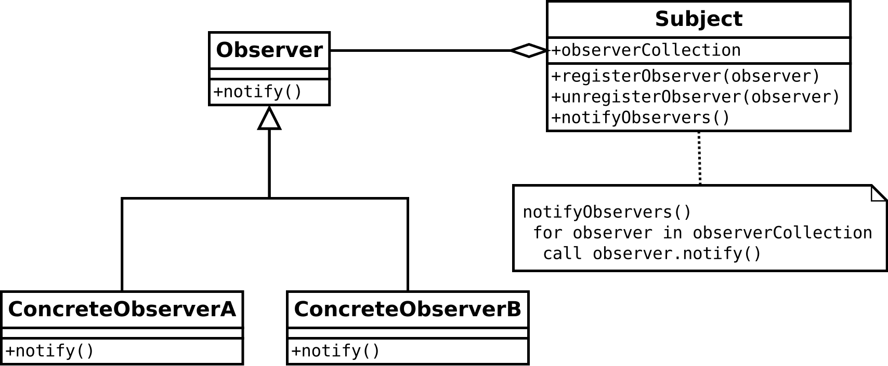

# 옵저버 패턴

> 옵저버 패턴(Observer Pattern)은 객체의 상태 변화를 관찰하는 관찰자들, 즉 옵저버들의 목록을 객체에 등록하여 상태 변화가 있을 때마다 메서드 등을 통해 객체가 직접 목록의 각 옵저버에게 통지하도록 하는 디자인 패턴이다. 주로 분산 이벤트 핸들링 시스템을 구현하는 데 사용된다. 발행/구독 모델로 알려져 있기도 하다.

- 어떤 객체의 상태가 변할 때 그와 연관된 객체들에게 알림을 보내는 디자인 패턴
- 1 대 1 또는 1 대 N 관계를 가질 수 있다.
- 다른 객체의 상태 변화를 별도의 함수 호출 없이 알 수 있다.

## 장단점

### 장점

1. 실시간으로 한 객체의 변경사항을 다른 객체에 전파할 수 있다
2. 느슨한 결합(Loose Coupling)으로 시스템이 유연하고 객체간의 의존성을 제거할 수 있다.

### 단점

1. 너무 많이 사용할 경우 상태 관리가 힘들 수 있다.
2. 데이터 배분에 문제가 발생하면 큰 문제로 발전할 수 있다.

## 구현 원리

- 옵저버 또는 리스너(listener)라 불리는 하나 이상의 객체를 관찰 대상이 되는 객체에 등록
- 각각의 옵저버들은 관찰 대상인 객체가 발생하는 이벤트를 받아 처리

- 이벤트가 발생하면 각 옵저버는 콜백을 받는다
- 각각의 파생 옵저버는 nofity함수를 구현함으로서 이벤트가 발생했을 때 처리할 각자의 동작을 정의해야한다
- 한 객체에 객체를 포함시키는 것이 아닌 인터페이스를 포함하는 방식으로 구현(느슨한 결합)
- 옵저버 패턴이 많이 쓰인 시스템에서는 재귀 호출을 막는 매커니즘이 필요
