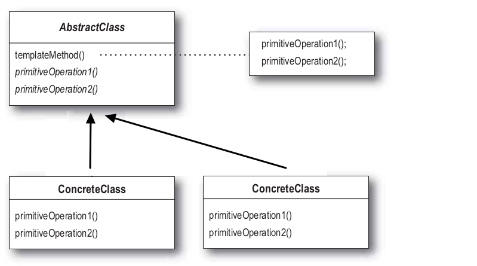
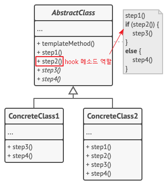

# 템플릿 메소드

> 템플릿 메소드 패턴은 여러 클래스에서 공통으로 사용하는 메소드를 템플릿화하여 상위 클래스에서 정의하고, 하위 클래스마다 세부 동작을 다르게 구현하는 패턴이다.

- **변하지 않는 기능(템플릿)은 상위 클래스**에 만들어두고 **자주 변경되며 확장할 기능은 하위 클래스**에서 만들도록 하여, 상위의 메소드의 실행 동작 순서는 고정하면서 세부 실행 내용은 다양화 할 수 있는 경우에 사용된다.
- 상속을 극대화한 개념으로 **알고리즘의 뼈대**를 맞추는 것에 초점을 둔 디자인 패턴
- 수많은 프레임워크에서 많은 부분에 적용되어 있다.

> 디자인 패턴에서의 템플릿은 변하지 않는 것을 의미한다.

## 템플릿 메소드 패턴 구조

- **AbstractClass(추상 클래스)**
  - **템플릿 메소드를 구현**하고 템플릿 메소드에서 돌아가는 **추상 메소드**를 선언한다.
  - 추상 메소드는 하위 클래스에서 구현한다.
- **ContreteClass(구현 클래스)**
  - 추상 클래스를 상속하고 **추상 메소드를 구현**한다.
  - 구현 클래스에서 구현한 메소드는 추상 클래스의 **템플릿 메소드에서 호출**된다.

### hook 메소드

- hook(훅) 메소드는 부모의 템플릿 메소드의 **영향이나 순서를 제어**하고 싶을 때 사용되는 메서드 형태를 말한다.
- step2() 메소드의 참, 거짓 유무에 따라 step3() 또는 step4()가 실행되는 형식으로 템플릿 메소드에 영향을 줄 수 있다.
- 훅 메소드는 추상 메소드가 아닌 **일반 메소드**로 구현 -> 선택적으로 오버라이드하여 제어하거나 그렇지 않거나 하기 위함이다

## 템플릿 메소드 특징

### 사용 시기

- 클라이언트가 알고리즘의 특정 단계만 확장하고, 전체 알고리즘이나 해당 구조는 확장하지 않도록 할 때
- 동일한 기능은 상위 클래스에서 정의하면서 확장, 변화가 필요한 부분만 하위 클래스에서 구현할 때

### 장점

- 클라이언트가 대규모 알고리즘의 특정 부분만 재정의하도록 하여, 알고리즘의 다른 부분에 발생하는 변경 사항의 영향을 덜 받도록한다.
- 상위 추상클래스로 로직을 공통화하여 코드의 중복을 줄일 수 있다.
- 서브 클래스의 역할을 줄이고, 핵심 로직을 상위 클래스에서 관리하므로서 관리가 용이해진다.
  - 헐리우드 원칙(Hollywood Principle): 고수준 구성요소에서 저수준을 다루는 원칙(추상화에 의존)

### 단점

- 알고리즘의 제공된 골격에 의해 유연성이 제한될 수 있다.
- 알고리즘의 구조가 복잡할수록 템플릿 로직 형태를 유지하기 어려워진다.
- 추상 메소드가 많아지면서 클래스의 생성, 관리가 어려워질 수 있다.
- 상위 클래스에서 선언된 추상 메소드를 하위 클래스에서 구현할 때, 그 메소드가 어느 타이밍에서 호출되는지 클래스 로직을 이해해야 할 필요가 있다.
- 로직에 변화가 생겨 상위 클래스를 수정할 때, 모든 서브 클래스의 수정이 필요 할 수도 있다.
- 하위 클래스를 통해 기본 단계 구현을 억제하여 **리스코프 치환 법칙**을 위반할 여지가 있다.

#### 리스코프 치환원칙

> Liskov Substitution Priciple

- 서브 타입은 언제나 기반 타입으로 교체할 수 있어야 한다는 것을 뜻한다.
- 부모 클래스 인스턴스를 자식 클래스 인스턴스로 교체하여도 코드가 원래 의도대로 작동해야 함을 뜻한다.
- 상위 타입을 상속받은 모든 하위 타입은 상위 타입과 같은 의도의 동작을 해야한다.
