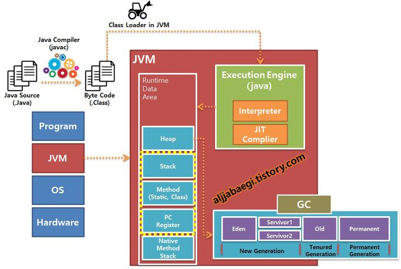

## Java 컴파일




### Java 컴파일 과정
1. 개발자가 자바 소스코드(.java)를 작성합니다.

2. 자바 컴파일러(Java Compiler)가 자바 소스파일을 컴파일합니다. 이때 나오는 파일은 `자바 바이트` 코드(.class)파일로 아직 컴퓨터가 읽을 수 없는 자바 가상 머신이 이해할 수 있는 코드입니다. 바이트 코드의 각 명령어는 1바이트 크기의 Opcode와 추가 피연산자로 이루어져 있습니다.

3. 컴파일된 바이트 코드를 JVM의 클래스로더(Class Loader)에게 전달합니다.

4. 클래스 로더는 동적로딩(Dynamic Loading)을 통해 필요한 클래스들을 로딩 및 링크하여 런타임 데이터 영역(Runtime Data area), 즉 JVM의 메모리에 올립니다.

> 클래스 로더 세부 동작
로드 : 클래스 파일을 가져와서 JVM의 메모리에 로드합니다.
> 
> 검증 : 자바 언어 명세(Java Language Specification) 및 JVM 명세에 명시된 대로 구성되어 있는지 검사합니다.
> 
> 준비 : 클래스가 필요로 하는 메모리를 할당합니다. (필드, 메서드, 인터페이스 등등)
> 분석 : 클래스의 상수 풀 내 모든 심볼릭 레퍼런스를 다이렉트 레퍼런스로 변경합니다.
> 초기화 : 클래스 변수들을 적절한 값으로 초기화합니다. (static 필드)
> <br>
> `동적 로딩의 종류`
>- 로드타임 동적 로딩
> > ``` public class HelloWorld {
> >     public static void main(String[] args) {
> >        System.out.println("안녕하세요!");
> >     }
> >  }
> >``` 
> > JVM이 시작되고, 부트스트랩 클래스로더가 생성된 후에, 모든 클래스가 상속받고 있는 Object 클래스를 읽어온다. 그 이후에, 클래스로더는 명령행에서 지정한 HelloWorld 클래스를 로딩하기 위해, HelloWorld.class 파일을 읽는다. HelloWorld 클래스를 로딩하는 과정에서 필요한 클래스가 존재한다. 바로 java.lang.String과 java.lang.System이다. 이 두 클래스는 HelloWorld 클래스를 읽어오는 과정에서, 즉 로드타임에 로딩된다. 이 처럼, 하나의 클래스를 로딩하는 과정에서 동적으로 클래스를 로딩하는 것을 로드타임 동적 로딩이라고 한다
>- 런타임 동적 로딩
> > ```public class RuntimeLoading { 
>>        public static void main(String[] args) { 
>>              try { 
>>                      Class cls = Class.forName(args[0]); 
>>                      Object obj = cls.newInstance(); 
>>                      Runnable r = (Runnable) obj; 
>>                      r.run(); 
>>              } catch (Exception e) {
>>                      e.printStackTrace();
>>               }
>>      }
>>}```
>>위 코드에서 Class.forName(className) 은 파라미터로 받은 className에 해당하는 클래스를 로딩한 후에 객체를 반환하며, 다음과 같이 동작한다.
>>Class.forName() 메소드가 실행되기 전까지는 RuntimeLoading 클래스에서 어떤 클래스를 참조하는지 알 수 없다.
>>따라서 RuntimeLoading 클래스를 로딩할 때는 어떤 클래스도 읽어오지 않고, RuntimeLoading 클래스의 main() 메소드가 실행되고 Class.forName(args[0]) 를 호출하는 순간에 비로소 args[0] 에 해당하는 클래스를 로딩한다.
>>이처럼 클래스를 로딩할 때가 아닌, 코드를 실행하는 순간에 클래스를 로딩하는 것을 런타임 동적 로딩이라고 한다.


5. 실행엔진(Execution Engine)은 JVM 메모리에 올라온 바이트 코드들을 명령어 단위로 하나씩 가져와서 실행합니다. 이때, 실행 엔진은 두가지 방식으로 변경합니다.

> 인터프리터 : 바이트 코드 명령어를 하나씩 읽어서 해석하고 실행합니다. 하나하나의 실행은 빠르나, 전체적인 실행 속도가 느리다는 단점을 가집니다.

> JIT 컴파일러(Just-In-Time Compiler) : 인터프리터의 단점을 보완하기 위해 도입된 방식으로 바이트 코드 전체를 컴파일하여 바이너리 코드로 변경하고 이후에는 해당 메서드를 더이상 인터프리팅 하지 않고, 바이너리 코드로 직접 실행하는 방식입니다. 하나씩 인터프리팅하여 실행하는 것이 아니라 바이트 코드 전체가 컴파일된 바이너리 코드를 실행하는 것이기 때문에 전체적인 실행속도는 인터프리팅 방식보다 빠릅니다.