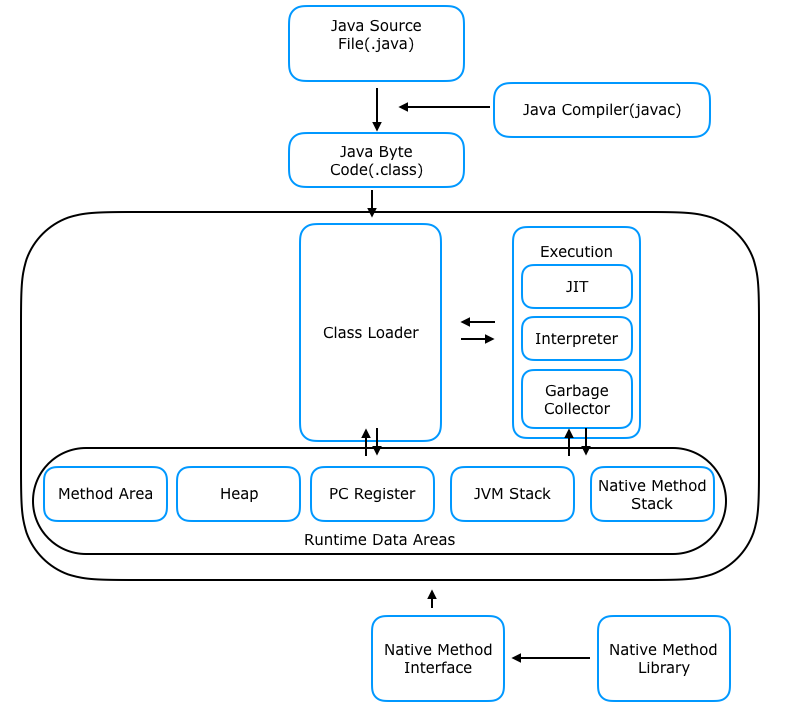

## Java 가상 머신(JVM)

### 의미
> 자바 프로그램 실행 환경을 만들어 주는 소프트웨어
> OS에 종속되지 않고 CPU가 Java를 인식, 실행할 수 있도록 해주는 가상 컴퓨터를 의미한다. 
>즉, `시스템 메모리를 관리`하면서, `자바 기반 애플리케이션을 위해 이식 가능한 실행 환경`을 제공함
### JVM 구성

---
#### Class Loader 
> 런타임시에 처음으로 클래스를 참조할 때 해당 클래스를 로드하고 메모리 영역에 배치시킴. 이러한 동적 로드를 담당하는 부분이 Class Loader 이다.
#### Runtime Data Areas
> JVM이 운영체제 위에서 샐행되면서 할당받는 메모리의 영역
> 구성
> - `PC 레지스터` : 스레드가 어떤 명령을 실행되어야 할지 기록하는 부분( JVM 명령의 주소를 가짐)
> - `스택 Area` :  지역변수, 매개변수, 메서드 저옵, 임시 데이터 등을 저장
> - `Native Method Stack` : 실제 실행할 수 있는 기계어로 작성된 프로그램을 실행시키는 영역
> - `Heap` : Run time에 동적으로 할당되는 데이터가 저장되는 영역, 객체나 배열 생성이 여기에 해당한다.
> - `Method Area` : JVM이 실행될 때 생성되고, JVM이 읽은 각각의 클래스와 인터페이스에 대한 런타임 상수 풀, 필드 및 메서드 코드, Static 변수, 메서드의 바이트 코드 등을 보관
#### 가비지 컬렉션
> 자바 이전 모든 언어에서는 프로그래머가 프로그램 메모리를 관리했지만, 자바에서는 JVM을 통해 메모리를 관리함.
- 가비지 컬렉션은 자바 프로그램에서 사용되지 않는 메모리를 지속적으로 찾아내서 제거하는 역할을 함

- 가비지 컬렉션 실행 순서 : 참초되지 않은 객체들을 탐색 후 삭제 -> 삭제된 객체의 메모리 반환 -> 힙 메모리 재사용

### 실행 과정
1. 프로그램이 실행되면, JVM은 OS로부터 이 프로그램이 필요로하는 메모리를 할당받음. JVM은 이 메모리를 용도에 따라 여러 영역으로 나누어 관리함

2. 자바 컴파일러(JAVAC)가 자바 소스코드를 읽고, 자바 바이트코드(.class)로 변환시킴

3. 변경된 class 파일들을 클래스 로더를 통해 JVM 메모리 영역으로 로딩함

4. 로딩된 class파일들은 Execution engine을 통해 해석됨

5. 해석된 바이트 코드는 메모리 영역에 배치되어 실질적인 수행이 이루어짐. 이러한 실행 과정 속 JVM은 필요에 따라 스레드 동기화나 가비지 컬렉션 같은 메모리 관리 작업을 수행함

