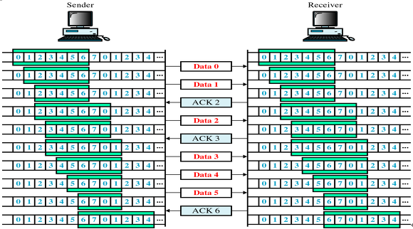
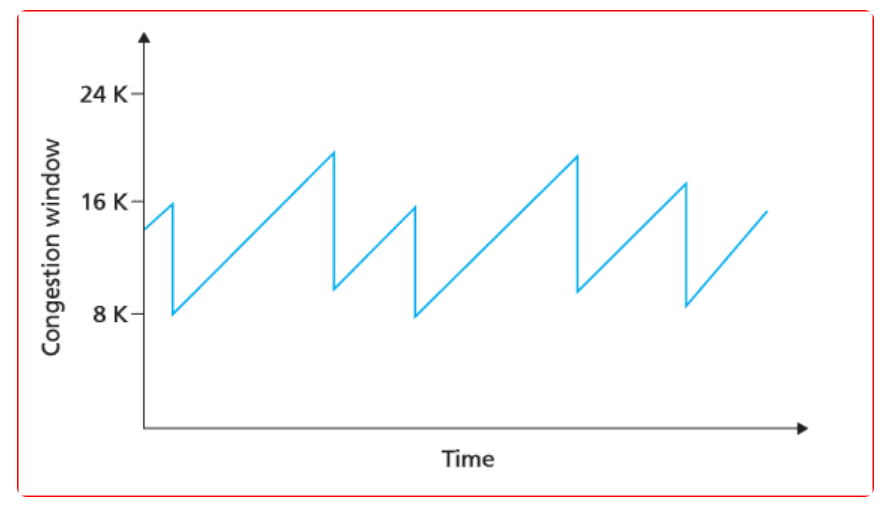
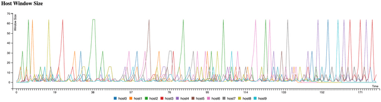
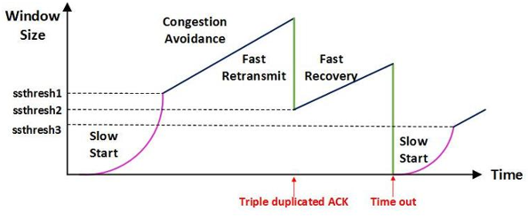

# TCP/IP (흐름제어/혼잡제어)

## TCP 통신이란?

- 네트워크 통신에서 신뢰적인 연결방식
- TCP는 기본적으로 unreliable network에서, reliable network를 보장할 수 있도록하는 프로토콜
- TCP는 network congestion avoidance algorithm(네트워크 혼잡 회피 알고리즘)을 사용

### reliable network 보장의 4가지 문제점

1. 손실: 패킷이 손실될 수 있는 문제
2. 순서 바뀜: 패킷의 순서가 바뀌는 문제
3. Congestion: 네트워크가 혼잡한 문제
4. Overload: receiver가 overload 되는 문제

## 흐름제어

- 수신 측이 송신 측보다 데이터 처리 속도가 느린 경우, 수신 측의 제한된 저장 용량을 초과한 패킷이 손실됨 -> 추가 패킷 전송으로 인한 자원 낭비 발생
- 송신 측과 수신 측의 TCP 버퍼 크기 차이로 인해 생기는 데이터 처리 속도 차이를 해결하기 위한 기법
  - **TCP 버퍼**
    - 송신 측은 버퍼에 TCP 세그먼트를 보관한 후 순차적으로 전송하고, 수신 측은 도착한 TCP 세그먼트를 애플리케이션이 읽을 때까지 버퍼에 보관한다.

### Stop and Wait

- 매번 전송한 패킷에 대해 확인 응답(ACK)를 받으면 다음 패킷을 전송하는 방법
- 패킷을 하나씩 보내기 때문에 비효율적

### Sliding Window

- 수신 측에서 설정한 윈도우 크기만큼 송신 측에서 확인 응답 없이 패킷을 전송할 수 있게하여 데이터 흐름을 동적으로 조절하는 제어 기법
- 윈도우 크기
  - 최초의 윈도우 크기는 3way handshaing을 통해 수신 측을 윈도우 크기로 설정
  - 수신 측의 남은 버퍼 크기에 따라 가변
  - 수신 측에서 확인 응답을 보낼 때 TCP 헤더(window size)에 담아 보냄
  - 윈도우는 메모리 버퍼의 일정 영역이라고 볼 수 있다.
- 동작 방식
  - 윈도우에 포함된 패킷을 계속 전송
  - 수신 측에서 확인 응답이 오면 윈도우를 옆으로 옮겨 다음 패킷 전송
    
  - 최초로 수신자는 윈도우 사이즈를 7로 정한다
  - 송신자는 확인 응답이 올때까지 데이터를 보낸다
  - 수신자는 슬라이딩 윈도우 사이즈를 충족할 수 있게 윈도우를 옆으로 옮긴다
  - 데이터를 전부 전송할 때까지 반복한다
- 재전송
  - 송신 측에서 일정 시간 수신 측의 확인 응답을 받지 못하면 패킷을 재전송한다.
  - 재전송시 패킷이 손실된 것이 아니라 수신 측의 버퍼 공간이 부족한 경우 문제가 생긴다
  - 수신 측은 확인 응답을 보내면서 남은 버퍼의 크기(윈도우 크기)도 함께 보내 준다

## 혼잡제어

### AIMD(Additive Increase/Multicative Decrease)

- 합 증가/곱 감소 방식
- 처음에 패킷을 하나씩 보냄
- 문제가 없으면 윈도우 크기를 1씩 증가시켜가며 전송
- 전송 실패시 윈도우 크기를 반으로 줄임
- 윈도우 크기를 너무 조금씩 늘리기 때문에 네트워크의 모든 대역을 활용하여 제대로된 속도로 통신하기까지 시간이 오래 걸린다는 단점이 있다.
  

### Slow Start(느린 시작)

- AIMD 방식은 윈도우 크기가 선형적으로 증가 -> 최대 속도까지 시간이 오래 걸림
- Slow Start 방식은 윈도우 크기를 2배씩 지수적으로 증가
- 혼잡이 감지되면 윈도우 크기를 1로 줄임
- 윈도우 크기가 처음에는 느리게 증가하지만 점점 빠르게 증가한다는 장점이 있다
  

### 빠른 재전송(Fast Retransmit)

- 먼저 도착할 패킷이 도착하지 않고 다음 패킷이 도착한 경우에도 확인 응답을 보냄
- 단 확인 응답에 순서가 맞게 도착한 마지막 패킷의 다음 순번을 담아 보냄
- 송신 측에서는 중복된 확인 응답으로 누락된 패킷을 감지 -> 재전송
- 중복된 순번의 패킷을 3개 받으면 재전송 & 윈도우 크기를 줄인다

### Fast Recovery(빠른 회복)

- 혼잡한 상태가 되면 윈도우 크기를 1로 줄이지 않고 반으로 줄인 후 선형 증가
- 혼잡 상황 이전까지는 지수 증가하다가 이후에는 AIMD로 동작
  
