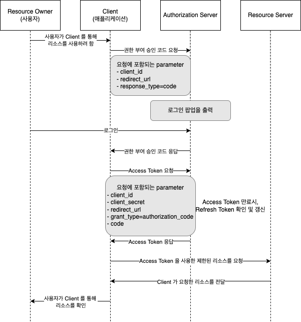

# 🔐 OAuth 2.0

> 인증을 위한 업계 표준 프로토콜이며, 어플리케이션에서의 특정 권한 부여 흐름을 제공하는 동시에 개발자의 단순성에 초점을 맞춘다.
> 써드파티 프로그램에게 리소스 소유자를 대신하여 자원에 대한 접근 권한을 위임하는 방식을 제공한다.

 

## 주요 용어

- **Resource Server** : Oauth 서비스를 제공하며 자원을 관리하는 서버
- **Resource Owner** : Resource Server의 계정을 보유하고 있는 사용자로 클라이언트를 인증하는 역할을 수행
- **Client** : 보호된 자원을 사용하려고 접근 요청을 하는 어플리케이션
- **Authorization Server** : Client가 Resource Server의 서비스를 사용할 수 있게 인증하고 토큰을 발행해 주는 서버
- **Access Token** : 자원을 획득하려고 할 때 사용되는 만료 기간이 있는 Token
- **Refresh Token** : Access Token이 만료되었을 때 이를 갱신하기 위해 사용하는 Token
- **Authentication** : 인증 -> 접근 자격이 있는지에 대해 검증
- **Authorization** : 인가 -> 리소스에 접근할 수 있는 권한을 부여

 

## Request & Response

- **client_id, client_secret** : 클라이언트의 자격증명
- **redirect_url** : Authorization Server에서 Client가 요청한 응답을 보낼 때 사용할 url
- **responser_type** : 권한 부여 방식에 대한 parameter이며 code, token 중 하나를 사용합니다.
- **state** : CSRF 공격(사이트 간 요청 위조)에 대비하기 위해 클라이언트가 권한서버에 요청 시 포함하는 임의의 문자열
- **grant_type** : Access Token 요청 시 포함되는 값으로, 권한 부여 방식에 대한 설정
- **token_type** : 발행된 Token의 타입으로, Baerer, MAC 등이 있습니다.
- **expires_in** : 토큰의 만료 시간

 

## 인증 절차

### 1. Authorization Code Grant

- 권한 부여 승인을 위헤 자체 생성한 Authorization Code 를 전달하는 방식으로 많이 쓰인다.
- Refresh Token 사용 가능
- 타사의 클라이언트에게 보호된 자원을 제공하기 위한 인증에 사용

 

### 2. Implicit Grant

- 자격증명을 안전하게 저장하기 힘든 클라이언트에게 최적화된 방식
- 권한 부여 승인 코드 없이 바로 Access Token 발급
- Refresh Token 사용 불가능
- Access Token이 URL을 통해 전달되므로 위험하므로 만료 기간을 되도록 짧게 설정

 

### 3. Resource Owner Password Credentials Grant

- 단순히 username과 password로 자격을 증명하는 방식
- Refresh Token 사용 가능

 

### 4. Client Credentials Grant

- 가장 간단한 방식으로 해당 클라이언트를 위한 제한된 리소스 접근 권한이 설정되어 있는 경우 사용
- Refresh Token 사용 불가능

  

[출처](https://velog.io/@wooyoung-tom/oauth)
